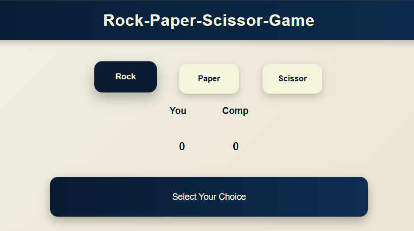

# Rock-Paper-Scissors Game

A simple **Rock-Paper-Scissors** game where you can play against the computer. Select Rock, Paper, or Scissors, and see who wins each round. Scores are tracked automatically.

## Demo

## Technologies Used

- **HTML** – page structure  
- **CSS** – styling and layout  
- **JavaScript** – game logic and interactivity  

## How to Play

1. Clone or download the repository.  
2. Open `index.html` in your browser.  
3. Click one of the buttons: **Rock**, **Paper**, or **Scissors**.  
4. The computer will choose randomly.  
5. The result will appear in the status box, and scores will update.  

## File Structure
rock-paper-scissors/
├── index.html # HTML structure
├── f.css # Styles
└── s.js # Game logic
 
 
## Features

- Player vs computer gameplay  
- Dynamic score tracking  
- Responsive buttons with hover effects  
- Status box shows win, lose, or draw  

## Future Enhancements

- Add icons or animations for choices  
- Add sound effects for wins/losses  
- Mobile responsive design  
- Best-of-5 or Best-of-10 rounds  

## License

This project is open-source and free to use.
